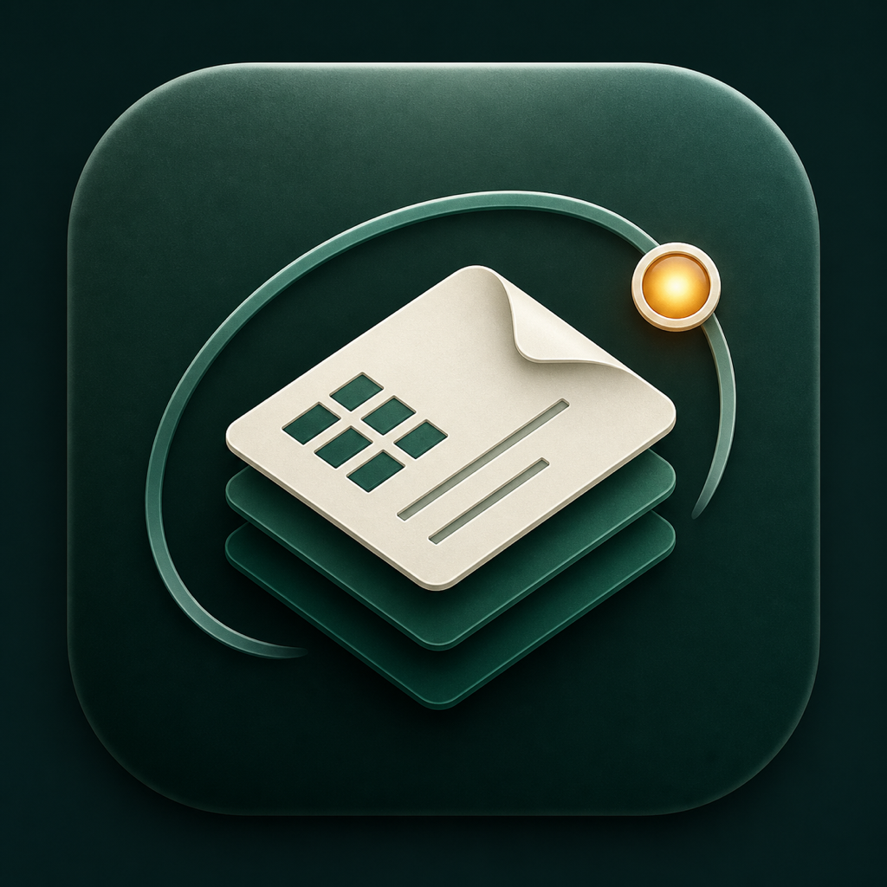
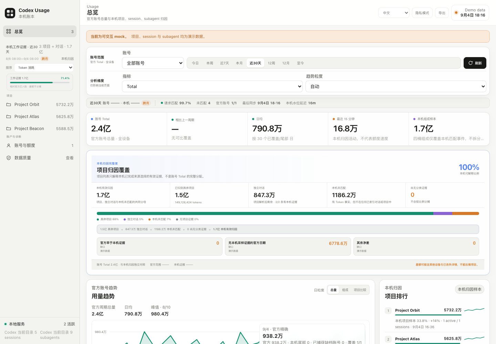

# Codex Usage Ledger

<p align="center">
  
</p>

Codex Usage Ledger is a standalone, local-first macOS application for auditing
Codex activity on one machine. Its native app surface lives in both the menu bar
and Dock. A Rust core reads Codex's official account usage through the bundled
app-server, performs replay-safe local attribution, and serves a React dashboard
for totals, projects, sessions, quota, and data-quality evidence.



_Project/session explorer shown with bundled demo data. Production account totals
come from Codex; project/session attribution remains local and auditable._

> Status: correctness-first MVP. The application is read-only with respect to
> Codex authentication: it asks Codex's own app-server for read-only usage. It
> never copies or stores OAuth credentials, refreshes tokens, switches accounts,
> or writes `auth.json`.

## Product surfaces

- **macOS app:** the primary end-user surface, targeting Apple Silicon and macOS
  13 or newer. It provides menu-bar access, a Dock-hosted dashboard window, and
  persistent page zoom through `⌘+`, `⌘−`, and `⌘0`.
- **Rust core:** the collector, replay guard, SQLite ledger, local REST/SSE API,
  and command-line diagnostics. The core remains testable on macOS, Linux, and
  Windows. Tagged releases include x86-64 Linux and Windows CLI/local-service
  archives in addition to the macOS GUI app.
- **React dashboard:** the local usage, quota, timeline, and data-quality UI,
  served from the loopback-only Rust process and hosted by the macOS app. Its
  Codex-style sidebar drills from overview to project folders, root sessions,
  and replay-safe subagent usage trees. Account/project/model/metric/period/grain
  filters share one query contract; lower-detail surfaces use tabs rather than
  an unbounded card stack. The dashboard supports Chinese and English without a
  data reload, persists that choice through the native shell, and switches to a
  single-column navigation and taller chart geometry in compact windows.

The standalone app does not install an editor or agent extension, skill, Login
Item, or LaunchAgent.

## Why a new ledger

Naively rescanning every JSONL file and summing each thread's cumulative total
double-counts subagent forks. Conversely, the strict local post-sampling matcher
can undercount the account total because it sees only evidence retained on this
machine. Codex Usage Ledger therefore keeps two ledgers with different jobs:

- Codex `account/usage/read` is authoritative for account lifetime and daily totals.
- Local attribution chooses the more complete of matched Sampling and replay-safe
  Reconstruction for each thread/day. The two sources are never added together
  and local attribution is never silently promoted to the account total.

When the user confirms that additional accounts exist but only some have been
captured, the app exposes a third, explicitly estimated view. It compares each
captured account with its own official daily bucket and sums only positive local
over-attribution. That conservative residual can be attributed to projects and
Token composition for all missing accounts combined; it cannot split one
unknown account from another and is never added to either primary ledger.

```text
Codex app-server ── account/usage/read ──► official account totals + daily buckets
                                             │
state_5.sqlite session index ─────────────► project/session directory
logs_2.sqlite ID cursor ─┐
rollout byte cursors ────┴──► Sampling + prefix-safe Reconstruction
                              │ choose one source / thread / day
               effective local project/session attribution
                              │
             reconciliation + local REST/SSE API
                              │
                     React dashboard
                              │
             macOS menu-bar + Dock application
```

## Accounting model

- The default local composition is four mutually exclusive buckets: uncached
  input, cache reads, cache writes, and output. Reasoning remains an output
  detail. Legacy rows whose source did not expose cache writes retain an
  explicit coverage gap instead of a fabricated zero.
- Account totals and the daily activity curve come from the signed-in Codex
  account profile. Local confirmed, quarantined, and unknown sampling remain
  separately visible as attribution evidence.
- Every overview exposes the project-attribution coverage equation: named
  projects + indexed standalone conversations + locally unmatched evidence +
  usage with no local evidence = the displayed account Total. A standalone
  conversation is a projectless root remaining after the complete native/root/
  Git/parent project resolver has run, together with its recursive subagent
  tree; a null project field alone is not enough.
  The uncovered remainder is split into auditable time/evidence buckets and is
  never proportionally assigned to projects.
- Account ownership is a temporal observation. A current auth snapshot never
  relabels historical sessions.
- Project resolution uses manual assignment, native project metadata, longest
  configured root, repository identity, parent inheritance, then unassigned.
  The dashboard subsequently separates directory-backed projectless root trees
  as `独立对话`; null-project facts outside those trees remain `未匹配记录`.
- Quota pools are dynamic server-defined lanes. A model route is not assumed to
  be a quota pool.
- Calendar periods use event source time, falling back to collector time only
  when the source timestamp is missing.
- `state_5.sqlite` is the authoritative current project/session directory. Its
  cumulative `threads.tokens_used` field is never summed or treated as usage.
- Retained rollout history is reconstructed incrementally. Dense child-prefix
  replay, unchanged totals and counter epochs are removed before facts enter a
  separate reconstruction ledger; durable Pending and Unrecoverable states
  prevent missing history from becoming a fabricated zero.
- Official daily buckets are durable per pseudonymous account and may be revised
  when the backend corrects a day. Matched local facts are retained for
  seven days; older events keep compact replay keys so a cursor reset cannot
  count them twice.
- Calendar and rolling windows remain distinct. The chart supports automatic or
  manual hour/day/week/month grains, a dashed previous-period comparison, and
  hatched uncovered ranges rather than false zeroes.

See the current [`accounting contract`](docs/contracts/accounting.md),
[`architecture overview`](docs/architecture/overview.md), and
[`dependency rules`](docs/architecture/dependency-rules.md) before changing the
ledger. Historical plans and audits are retained under `docs/archive/` as
evidence, not as current authority. Versioned verification receipts live under
`docs/releases/`.

Contributors should begin with [`CONTRIBUTING.md`](CONTRIBUTING.md) and the
nearest applicable `AGENTS.md`.

## Runtime behavior

On first launch, the app starts its bundled Rust executable in dashboard-only
`serve` mode, reads the active account's official usage through Codex app-server,
and loads the embedded React UI in a locked-down `WKWebView`.
Continuous collection is opt-in: the app explains the potential first-run scan
cost and switches to `daemon` mode only after the user confirms. That preference
is retained for later launches. Both modes bind to `127.0.0.1:47127` and serve
the dashboard bundled inside the application.

Daemon mode also tails official `rate_limits` from a bounded set of recently
active root rollouts using independent quota cursors. It excludes Subagent
replay, binds each snapshot through the covering login epoch, and never feeds
quota observations into Token totals.

The Rust child process belongs to the app lifecycle. Quitting the app terminates
it, with a bounded forced-stop fallback if graceful termination does not finish.
Nothing is registered to run independently at login.

## Build the macOS app

Requirements:

- Apple Silicon Mac running macOS 13 or newer
- Xcode Command Line Tools (`xcrun swiftc` and `codesign`)
- Rust stable (edition 2024)
- Node.js 22 and npm

The app has one canonical build entry point:

```bash
bash macos/build-app.sh
open "dist/Codex Usage Ledger.app"
```

The script builds the release Rust core and production React dashboard, compiles
the native Swift shell, assembles the `.app`, validates `Info.plist`, applies an
ad-hoc local signature, verifies the nested signature, and prints SHA-256 values
for the bundle file manifest plus every bundled file. The resulting
local-development app is:

```text
dist/Codex Usage Ledger.app
```

Ad-hoc signing is suitable for local verification; it is not App Store or
Developer ID notarization evidence.

## Develop and test the core

The Rust core and dashboard can be developed without packaging the macOS app:

```bash
cargo fmt --all -- --check
cargo clippy --all-targets --all-features -- -D warnings
cargo test --all-targets --all-features

cd web
npm ci
npm run build
```

For a one-time post-sampling bootstrap. This also discovers retained log shards
and reconstructs account intervals from Codex login/logout markers:

```bash
cargo run --release -- import-post-sampling --vacuum
```

For local dashboard development:

```bash
cargo run --release -- daemon \
  --listen 127.0.0.1:47127 \
  --web-root ./web/dist
```

Then open <http://127.0.0.1:47127>. The daemon polls only `logs.id` values beyond
its durable log cursor, then reads only bytes beyond each affected rollout's
durable cursor. Both sources share a five-second watermark so a rollout cursor
cannot consume token detail before its post-sampling row becomes eligible.
Other useful core commands include:

```bash
cargo run --release -- summary --period week --timezone Asia/Shanghai
cargo run --release -- sync-official-usage
cargo run --release -- doctor
cargo run --release -- optimize-storage --vacuum
cargo run --release -- serve --listen 127.0.0.1:47127 --web-root ./web/dist
```

Run `cargo run -- --help` for all paths and filters. `CODEX_HOME`,
`CODEX_USAGE_LEDGER_DB`, and `CODEX_USAGE_LEDGER_WEB_ROOT` are supported. Source
paths are hashed before entering the ledger so the local API does not disclose
their absolute locations by default.

## Official account boundary

`account/usage/read` is account/workspace scoped, not IP or project scoped. The
Codex app-server requires ChatGPT authentication, constructs a backend client
from the active login, and calls the current profile (`/api/codex/profiles/me`,
or the corresponding ChatGPT backend route). Codex supplies the active
`ChatGPT-Account-Id` workspace header. The only optional request parameter is a
canonical `threadId`, which requests one thread's estimated model/token/credit
breakdown instead of the account-wide profile.

The app issues that thread query only when the user opens a session and caches a
successful result per pseudonymous account and canonical thread. A missing or
unsupported billing route remains explicitly unavailable; local attribution is
never relabeled as official thread billing.

The ledger binds each successful profile snapshot to the active HMAC-derived
account fingerprint. When Codex switches accounts, a new auth epoch and new
official account history are recorded. IP addresses and project paths are never
used to infer account identity.

Codex auth-log markers let the app recover historical account boundaries even
when collection started later. Raw account IDs are HMAC-fingerprinted in memory
and discarded. An account known only from history stays "待校准" until the user
next switches to it; the all-accounts official total is a lower bound until all
known accounts have been synchronized. The displayed lower bound adds
post-coverage local activity for synchronized accounts and selected-period
local evidence for unsynchronized accounts, so "全部账号" cannot be smaller
than one of its member accounts.

## Current evidence boundary

- Codex `account/usage/read` supplies the authoritative account summary and
  daily buckets. The backend may publish the current day late, so the UI shows
  `coverageThrough` and keeps today's local provisional activity separate.
- Retained `logs_2.sqlite` shards supply the independent post-sampling request whitelist;
  rollout JSONL supplies input/cache-read/cache-write/output detail only after a
  one-to-one time match. `state_5.sqlite` supplies current project/session metadata.
- Deleted sessions that were never collected are not reconstructed from
  `threads.tokens_used` or backups. Deleting local Codex history does not alter
  usage already committed to this ledger's verified daily aggregates.
- Local project/session attribution before the earliest retained
  `logs_2.sqlite` post-sampling row is intentionally unavailable. Official
  account history can still cover that period; the difference is shown as an
  attribution coverage gap rather than assigned to a guessed project.
- Official and local time ranges are displayed independently. A lifetime
  account Total beginning before the first retained local sampling event is not
  labeled with the local ledger's later start date, and project rankings always
  state that they cover local evidence only.
- Historical account ownership is reconstructed only where Codex login/logout
  markers bound a single workspace interval. Genuine signed-out or ambiguous
  gaps remain unknown.
- Official account Total has no input/cache-read/cache-write/output decomposition. Those
  dimensions in the GUI are always labeled as matched local samples and are
  never presented as a split of the official Total.
- Normalized quota observations currently come from local token-count events.
  The parser understands the read-only `wham/usage` shape, but v0.1.0 never calls
  it, refreshes OAuth, or writes authentication.

## Security and privacy

- The local API binds to `127.0.0.1` by default.
- The app never writes `auth.json`, stores access/refresh tokens, or performs
  OAuth refresh. The Codex app-server owns authentication and upstream calls.
- Persistent account identity uses HMAC-derived fingerprints; normalized quota
  storage excludes credentials, email addresses, and raw account identifiers.
- Prompt text and absolute private paths are not exposed through the dashboard
  API by default.
- Privacy mode visually redacts project, session, and subagent names for
  screenshots. The current filtered view can be exported as CSV/JSON, while the
  native macOS shell captures PNG using `WKWebView.takeSnapshot`.
- No telemetry is included.

Do not expose the local server through a public reverse proxy. Report security
issues privately as described in [`SECURITY.md`](SECURITY.md).

## License and visual attribution

The project is MIT licensed. Selectively adapted visual ideas are documented in
[`THIRD_PARTY_NOTICES.md`](THIRD_PARTY_NOTICES.md); audited projects are not used
as runtime dependencies.
